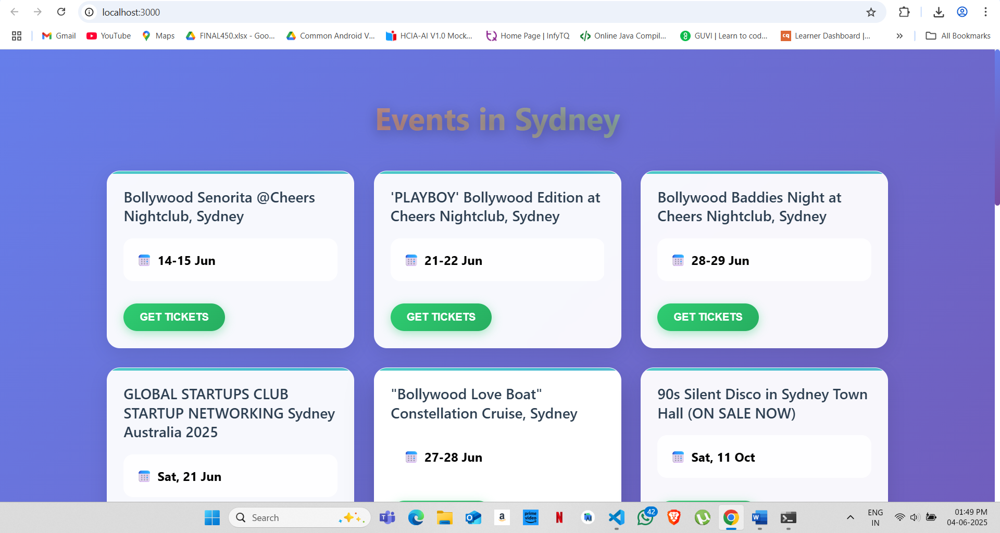
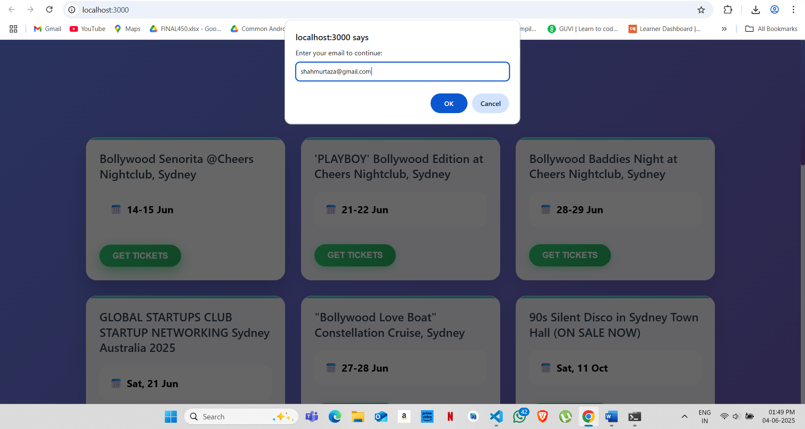
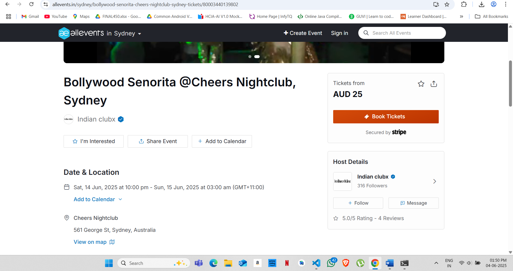

# Events Listing App

A full-stack application built with:

- **Frontend**: React + CSS 
- **Backend**: Node.js + Express + MongoDB + Cheerio for scraping

This app automatically scrapes events happening in Sydney, Australia from event listing websites and displays them beautifully in a clean interface.

---

## 🖼️ Screenshots

### 🎯 Homepage with Events

### 📩 Email Prompt for Ticket Access

### 🔗 Successful Redirection

## 🌟 Features

- Automatically fetches and displays real-time Sydney events.
- Displays event title, image (if available), and date.
- Users can click "GET TICKETS" to:
  - Enter their email (email opt-in).
  - Be redirected to the original ticketing site.
  - Have their email captured and stored in MongoDB.
- Minimalistic and clean UI.
- Automatically updates events.

---

## 🛠 Installation & Setup

### Clone the Project

git clone https://github.com/your-username/sydney-events-app.git
cd sydney-events-app

## 🔧 Backend Setup (`/server`)

### 1. Navigate to the backend folder

cd server

### 2. Install dependencies

npm install

### 3. Set up Environment Variables

Create a `.env` file inside the `server` folder and add your MongoDB URI:

MONGO_URI=your-mongodb-uri

### 4. Start the backend server

npm start

The backend will start on `http://localhost:5000`.

### 5. 🔗 API Endpoints

Events

GET /api/events - Fetch all scraped events
POST /api/scrape - Manually trigger event scraping

Email Capture

POST /api/capture-email - Save user email when accessing events

---

## 🎨 Frontend Setup (`/client`)

### 1. Navigate to the frontend folder

cd ../client

### 2. Install dependencies

npm install

### 3. Set up Environment Variables
Create a .env file inside the frontend folder:
envREACT_APP_API_URL=http://localhost:5000

### 4. Start the frontend server

npm start

The frontend will start on `http://localhost:3000`.

## 📝 Notes

- Make sure popups are allowed in your browser for redirecting users after email capture.
- You can modify the `scraper.js` to scrape different event sites if needed.

